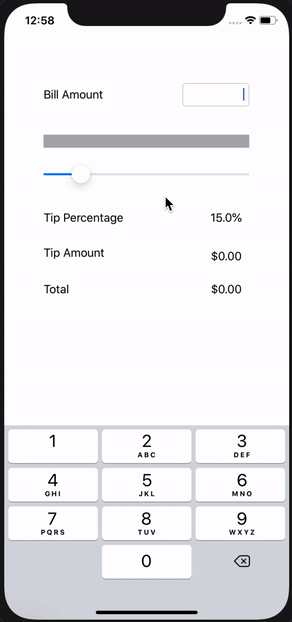

# Tipsy 

**Tipsy** is a tip calculator application for iOS.

## User Stories

The following functionality is complete:
* [X] User can enter a bill amount, choose a tip percentage, and see the tip and total values.
* [X] User can set tip amount using a slider
* [X] User can view app in dark mode or light mode

The following features are under development:
* [ ] Settings page to change the default tip percentage and slider bounds
* [ ] Remembering the bill amount across app restarts (if <10mins)
* [ ] Using locale-specific currency and currency thousands separators.
* [ ] Set keyboard as always visible and first responder
* [ ] Split bill between friends
* [ ] Export bill to Venmo/PayPal

## License

    Copyright 2020 Jonathan Singer

    Licensed under the Apache License, Version 2.0 (the "License");
    you may not use this file except in compliance with the License.
    You may obtain a copy of the License at

        http://www.apache.org/licenses/LICENSE-2.0

    Unless required by applicable law or agreed to in writing, software
    distributed under the License is distributed on an "AS IS" BASIS,
    WITHOUT WARRANTIES OR CONDITIONS OF ANY KIND, either express or implied.
    See the License for the specific language governing permissions and
    limitations under the License.
